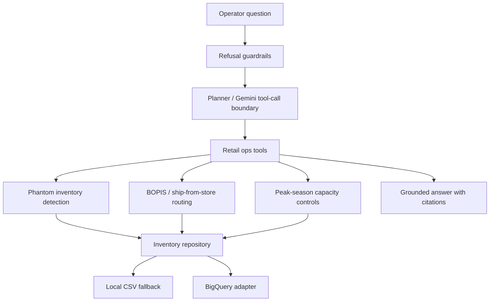

# Retail Ops Agent on GCP

A portfolio-grade retail operations agent that models how a Google Cloud customer engineer might scope a practical AI pilot for inventory accuracy, BOPIS routing, ship-from-store decisions, and peak-season operating controls.

The repo is intentionally synthetic and public-safe. It uses fake stores, SKUs, orders, and capacity data so the architecture and decision logic are visible without exposing customer data.

## Why This Matters

Retail platform modernization is not only a data warehouse story. Store operations depend on whether inventory, fulfillment capacity, routing rules, and customer promises all agree. This project demonstrates a small but complete pattern:

- BigQuery-style inventory truth layer
- Cloud Run-style HTTP serving boundary
- Vertex AI / Gemini-ready agent interface
- deterministic retail operations tools before LLM reasoning
- source-grounded answers with explicit evidence
- refusal guardrails for unsupported or unsafe requests
- tests and evals that prove the demo does what it claims

## Current Status

The core test/eval/demo path runs fully local with the Python standard library. Optional extras add FastAPI/Uvicorn and GCP clients for API serving, BigQuery seeding, and Cloud Run deployment.

## Architecture



See [docs/architecture.md](docs/architecture.md) for the intended GCP version.

## Run Locally

```bash
make test
make eval
make demo
```

Or run the demo directly:

```bash
python3 scripts/run_local.py
```

Run the HTTP API locally:

```bash
make run-api
curl -X POST http://127.0.0.1:8080/query \
  -H "Content-Type: application/json" \
  -d '{"question":"Route this BOPIS order for ZIP 27701 with SLA under 2 hours."}'
```

## Demo Prompts

1. Why is SKU-1842 showing available but failing pickup orders in Store 117?
2. Route this BOPIS order for ZIP 27701 with SLA under 2 hours.
3. We are entering Black Friday mode. Which stores should stop accepting ship-from-store orders?
4. Can you guarantee this item will be available tomorrow?
5. Show the evidence behind your routing decision.

## Acceptance Bar

The project is credible when:

- tests pass with `make test`
- evals pass with `make eval`
- routing decisions include cited evidence
- guardrails refuse unsupported guarantees and private-data requests
- README and docs explain why BigQuery, Vertex AI/Gemini, and Cloud Run fit the workload

## GitHub Actions

The workflow in `.github/workflows/ci.yml` runs:

```bash
make test
make eval
```

## Demo Transcript

See [docs/demo-transcript.md](docs/demo-transcript.md) for sample output from `make demo`.

## Public-Safety Note

All data is synthetic. Do not add customer names, customer diagrams, real order data, production endpoints, credentials, or screenshots from private systems.
