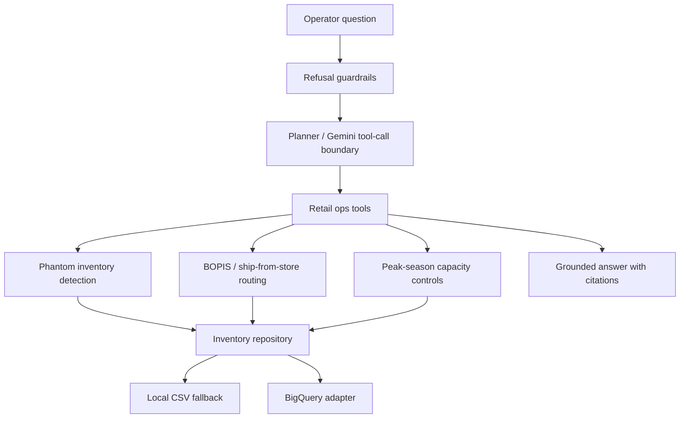

# Retail Ops Agent on GCP

[](https://github.com/akhileshthokala/retail-ops-agent-gcp/actions/workflows/ci.yml)

A portfolio-grade retail operations agent that models how a Google Cloud customer engineer might scope a practical AI pilot for inventory accuracy, BOPIS routing, ship-from-store decisions, and peak-season operating controls.

The repo is intentionally synthetic and public-safe. It uses fake stores, SKUs, orders, and capacity data so the architecture and decision logic are visible without exposing customer data.

## Why This Matters

Retail platform modernization is not only a data warehouse story. Store operations depend on whether inventory, fulfillment capacity, routing rules, and customer promises all agree. This project demonstrates a small but complete pattern:

- BigQuery-style inventory truth layer
- Cloud Run-style HTTP serving boundary
- Vertex AI / Gemini-ready agent interface
- deterministic retail operations tools before LLM reasoning
- source-grounded answers with explicit evidence
- refusal guardrails for unsupported or unsafe requests
- 40+ eval scenarios across six retail use cases that prove the demo does what it claims

## Current Status

The core test/eval/demo path runs fully local with the Python standard library. Optional extras add FastAPI/Uvicorn and GCP clients for API serving, BigQuery seeding, live Vertex AI / Gemini tool-call planning, and Cloud Run deployment.

## What Was Just Added

- Expanded the eval suite from 4 scenarios to 42 scenarios across six retail use cases.
- Added optional live BigQuery and Vertex AI / Gemini configuration paths while keeping the zero-dependency local demo as the default.
- Added claim-mapping documentation so the repo directly supports the resume bullet.
- Added a native GCP validation plan for the next pass.

## Architecture



See [docs/architecture.md](docs/architecture.md) for the intended GCP version.

## Run Locally

```bash
make test
make eval
make demo
```

Or run the demo directly:

```bash
python3 scripts/run_local.py
```

Run the HTTP API locally:

```bash
make run-api
curl -X POST http://127.0.0.1:8080/query \
  -H "Content-Type: application/json" \
  -d '{"question":"Route this BOPIS order for ZIP 27701 with SLA under 2 hours."}'
```

## Demo Prompts

1. Why is SKU-1842 showing available but failing pickup orders in Store 117?
2. Route this BOPIS order for ZIP 27701 with SLA under 2 hours.
3. We are entering Black Friday mode. Which stores should stop accepting ship-from-store orders?
4. Can you guarantee this item will be available tomorrow? (must refuse)
5. Show the evidence behind your routing decision.

## Acceptance Bar

The project is credible when:

- tests pass with `make test`
- evals pass with `make eval`
- routing decisions include cited evidence
- guardrails refuse unsupported guarantees and private-data requests
- README and docs explain why BigQuery, Vertex AI/Gemini, and Cloud Run fit the workload

## GitHub Actions

The workflow in `.github/workflows/ci.yml` runs:

```bash
make test
make eval
```

## Demo Transcript

See [docs/demo-transcript.md](docs/demo-transcript.md) for sample output from `make demo`.

## Customer Engineer Discovery

See [docs/discovery-questions.md](docs/discovery-questions.md) for retail scoping questions that connect this demo to a real Google Cloud Customer Engineer conversation.

## Next Step: Native GCP Validation

The next milestone is to run the same demo in a real sandbox GCP project: seed synthetic data into BigQuery, deploy the API to Cloud Run, and enable Vertex AI / Gemini tool-call planning behind `USE_VERTEX_AI=true`.

See [docs/native-gcp-validation.md](docs/native-gcp-validation.md) for the plug-and-play test plan.

## Configuration

Before deploying to Cloud Run, ensure the following environment variables are set:
- `USE_BIGQUERY=true` (Set to true to use live BigQuery data)
- `USE_VERTEX_AI=true` (Set to true to use Gemini for routing logic)
- `GOOGLE_CLOUD_PROJECT=[YOUR_PROJECT_ID]`

## Seeding BigQuery

To load the demo data into BigQuery, run:
```bash
python scripts/seed_bigquery.py
```

## Public-Safety Note

All data is synthetic. Do not add customer names, customer diagrams, real order data, production endpoints, credentials, or screenshots from private systems. This repo is safe to fork on a work machine because tracked files contain only public-safe code, synthetic CSVs, placeholder env examples, and docs.
