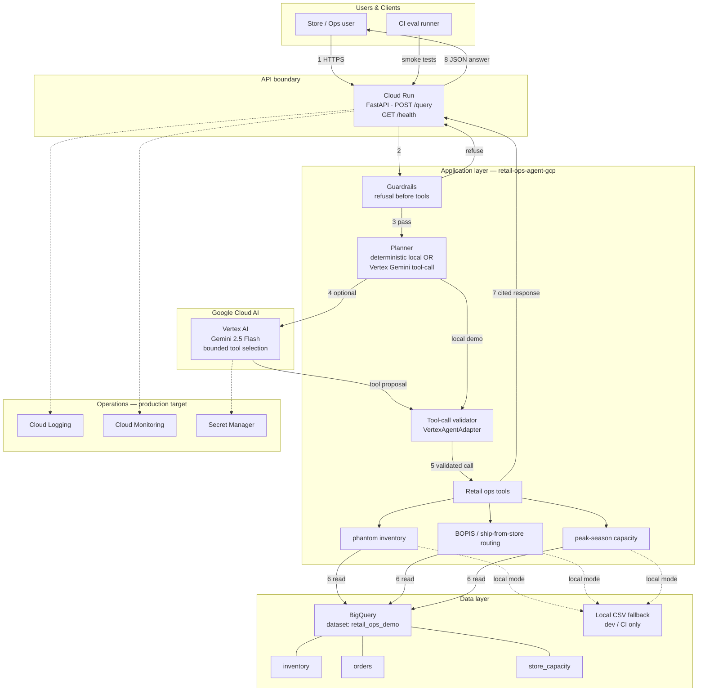

# Reference Architecture: AI-Assisted Retail Operations on Google Cloud

This document describes how the **Retail Ops Agent** maps to a Google Cloud reference architecture — the same pattern used in [13 popular application architectures for Google Cloud](https://cloud.google.com/blog/products/application-development/13-popular-application-architectures-for-google-cloud): a clear request path, named managed services, and a data layer behind bounded application logic.

> **Portfolio context:** Synthetic data only. No customer PII. Designed for Customer Engineer / FDE conversations about inventory truth, BOPIS routing, and peak-season controls.

---

## Overview

Retail operators need to reconcile **inventory accuracy**, **fulfillment capacity**, and **customer SLA promises** before routing BOPIS or ship-from-store orders. This architecture keeps **deterministic business logic in code** and uses **Vertex AI / Gemini only as a bounded planner** over whitelisted tools — avoiding the common failure mode where an LLM invents routing policy.

**Pattern family:** Serverless API + analytical data warehouse + ML inference over tools  
(similar to GCP blog patterns #9 *serverless microservices* and #11 *serverless processing pipelines*)

---

## Architecture Diagram

**Interactive version:** open [`architecture-diagram.html`](architecture-diagram.html) in a browser (screenshot for decks).



---

## How the architecture works

Walk through the request path the way a GCP reference doc describes it:

1. **A store or operations user** submits a natural-language question (e.g. *"Route this BOPIS order for ZIP 27701 with SLA under 2 hours"*) to the **Cloud Run** service over HTTPS.

2. **Cloud Run** hosts the FastAPI application (`app/api/main.py`). It scales to zero when idle and bursts on demand — appropriate for pilot traffic and CE demos.

3. **Guardrails run first** (`app/agent/guardrails.py`). Unsupported guarantees, private-data requests, and out-of-scope questions are **refused before** any model or tool executes.

4. **Planner selects execution path:**
   - **Local / demo mode:** deterministic keyword planner maps curated questions to tools (no cloud credentials).
   - **GCP mode (`USE_VERTEX_AI=true`):** **Vertex AI Gemini** proposes one of three whitelisted tool calls.

5. **Tool-call validation** (`VertexAgentAdapter.validate_tool_call`) enforces an allowlist and typed argument schema. Invalid model output is rejected before execution.

6. **Retail operations tools** (`app/agent/tools.py`) call deterministic services:
   - `explain_phantom_inventory` → anomaly detection vs. recent orders
   - `route_order` → BOPIS / ship-from-store scoring
   - `peak_season_recommendations` → capacity throttling signals

7. **Inventory repository** reads operational truth:
   - **Production shape:** **BigQuery** tables `inventory`, `orders`, `store_capacity` (parameterized SQL, `@store_id`, `@sku`)
   - **Local shape:** same schema in CSV files under `data/`

8. **Response includes cited evidence** — inventory and capacity row IDs in `sources[]` so operators can audit the decision without re-running the query.

9. **Eval regression suite** (`evals/eval_cases.json`, 42 scenarios) runs in CI via GitHub Actions to prove routing, grounding, and refusal behavior.

10. **Production hardening** (target): request logs to **Cloud Logging**, SLO dashboards in **Cloud Monitoring**, secrets in **Secret Manager**, authentication on Cloud Run (remove `--allow-unauthenticated`).

---

## Component reference

| Layer | Component | Role in this repo |
| --- | --- | --- |
| **Compute** | Cloud Run | HTTP API, container from `infra/cloudrun.Dockerfile` |
| **AI** | Vertex AI (Gemini) | Optional NL → tool-call planner; not the source of routing math |
| **Data** | BigQuery | Inventory / orders / capacity truth layer (`retail_ops_demo`) |
| **App** | Guardrails | Refusal-first policy checks |
| **App** | Retail ops tools | Deterministic business logic + citations |
| **App** | Vertex adapter | Schema validation for model-proposed tool calls |
| **Dev** | CSV repository | Zero-dependency local demo (`USE_BIGQUERY=false`) |
| **Ops** | Cloud Logging / Monitoring | Latency, refusal rate, eval pass rate (planned) |
| **Ops** | Secret Manager | API keys and config (planned) |
| **CI** | GitHub Actions | `make test` + `make eval` on every push |

---

## BigQuery data model

Dataset: **`retail_ops_demo`** (see [gcp-deployment.md](gcp-deployment.md))

| Table | Source file | Purpose |
| --- | --- | --- |
| `inventory` | `data/sample_inventory.csv` | On-hand, reserved, safety stock, distance signals |
| `orders` | `data/sample_orders.csv` | Recent fulfillment outcomes for phantom detection |
| `store_capacity` | `data/sample_store_capacity.csv` | Daily capacity, utilization, peak-season mode |

Seed: `GOOGLE_CLOUD_PROJECT=your-project python scripts/seed_bigquery.py`

---

## Why these Google Cloud services

| Service | Why it fits this workload |
| --- | --- |
| **Cloud Run** | Simple serverless API for a pilot: scale-to-zero, burst handling, one container for FastAPI. Matches GCP serverless microservice pattern. |
| **BigQuery** | Central **analytical truth layer** for inventory joins across stores, SKUs, and capacity — the same role data lakes play in retail ops at scale. |
| **Vertex AI / Gemini** | Natural-language **operator interface** over **bounded tools** — model selects *which* deterministic function to run, not *how* to score routes. |
| **Cloud Logging** | Audit trail for operator queries, refusal reasons, and tool latency in production. |
| **IAM service accounts** | Least-privilege access: BigQuery dataViewer + jobUser, aiplatform.user only when Vertex is enabled. |

---

## Deployment modes

### Mode A — Local MVP (default)

```text
Operator → localhost:8080 → Guardrails → Deterministic planner → Tools → CSV repository
```

- No GCP credentials required.
- Same tool contracts as production.
- `make test && make eval && make demo`

### Mode B — GCP sandbox

```text
Operator → Cloud Run → Guardrails → Vertex Gemini (optional) → Tools → BigQuery
```

```bash
GOOGLE_CLOUD_PROJECT=your-project ./infra/deploy.sh
```

Environment flags: `USE_BIGQUERY=true`, `USE_VERTEX_AI=true` (see `.env.example`).

### Mode C — Production target

Add authentication on Cloud Run, Secret Manager for config, API Gateway rate limits, and monitoring dashboards. See [gcp-deployment.md](gcp-deployment.md) hardening checklist.

---

## IAM boundary

Cloud Run service account (minimum for sandbox):

| Role | Scope | Why |
| --- | --- | --- |
| `roles/bigquery.dataViewer` | `retail_ops_demo` dataset | Read inventory truth |
| `roles/bigquery.jobUser` | Project | Run queries |
| `roles/aiplatform.user` | Project | Vertex Gemini tool planning (when enabled) |

---

## Design principles

1. **Deterministic tools before LLM reasoning** — routing scores and capacity math live in Python, not in prompt text.
2. **Validate every model tool call** — allowlist + typed args in `VertexAgentAdapter`.
3. **Refusal first** — guardrails short-circuit unsafe or unsupported requests.
4. **Cite evidence** — every routing answer includes source rows for operator audit.
5. **Evals as product** — 42 scenarios in CI; demo claims are testable.

See [design-decisions.md](design-decisions.md) for rationale.

---

## Related documents

- [GCP deployment plan](gcp-deployment.md)
- [Native GCP validation checklist](native-gcp-validation.md)
- [Eval methodology](eval-methodology.md)
- [Discovery questions for CE conversations](discovery-questions.md)
- [Visual architecture diagram](architecture-diagram.html)
